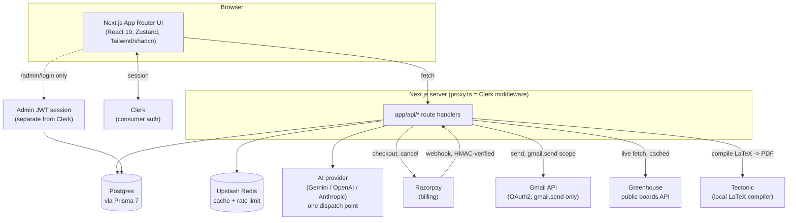

# Architecture

This document was generated by reading the actual code (routes, schema, config, and
in-code comments) — not by trusting prior docs in this folder. Where something here
contradicts an older doc, this one is the one that was re-verified.

## System overview



**The one thing worth internalizing about auth**: there are **two completely separate
auth systems** in this app, and they never touch each other. Regular users authenticate
through Clerk. The `/admin` dashboard has its own bcrypt+JWT session (a single-row
`Admin` table, `admin_session` cookie) checked independently in `proxy.ts` before any
Clerk logic even runs for `/admin*` and `/api/admin*` paths. See
[Why admin auth is separate from Clerk](#why-admin-auth-is-separate-from-clerk) below.

Everything user-owned is keyed by Clerk's `userId` string directly — there is **no
local `User` table**. `Subscription`, `UserPreferences`, `UserStatus`, `GmailAccount`,
`Resume`, etc. all just store `userId` as a plain column, not a foreign key, because
Clerk is the only source of truth for who a user is.

## Folder structure

```
app/
├── (marketing)/       Public pages: landing, features, pricing, templates, about, create (wizard)
├── (auth)/             login/, signup/ — Clerk-backed pages
├── (app)/               Authenticated app shell
│   ├── dashboard/         Home, resumes list, template gallery, analytics (STUB),
│   │                      settings (real), jobs/{tracker,discover,all,analyzer},
│   │                      ai/{outreach,audit}, outreach/{page,settings,history}
│   ├── builder/[resumeId]/ and builder/new/   Resume form editor + live preview
│   ├── cover-letter/
│   └── settings/          Dead stub duplicate — NOT linked anywhere; real page is
│                          (app)/dashboard/settings
├── (admin)/admin/       Separate auth realm — login/ (public) + (dashboard)/ (guarded):
│                        users, subscriptions, templates, plans, settings
├── api/                  51 route.ts files — see docs/API.md for every one
└── generated/prisma/     Prisma client output (custom `output` path in schema.prisma —
                           import from "@/app/generated/prisma/client", not "@prisma/client")

components/
├── ui/            shadcn/ui primitives
├── builder/         Resume form sections + AI helper widgets + live/PDF preview
├── dashboard/         Stat cards, resume list/grid, quick actions, AI insights, outreach activity
├── admin/              Admin-only tables/forms (users, subscriptions, templates, plan config)
├── outreach/            Quick Apply modal, outreach queue/history UI
├── jobs/                  Job Discovery cards/filters
├── settings/               Consumer Settings page cards (profile, billing, connected accounts, etc.)
├── pdf/                     @react-pdf/renderer templates (Modern/Professional/Classic)
├── marketing/, landing/       Landing page sections
├── auth/, modal/, wizard/, shared/, providers/

lib/
├── prisma.ts              Prisma client instance (via @prisma/adapter-pg)
├── db/                      Direct Prisma query modules: resumes.ts, applications.ts, subscription.ts
├── ai/                       llm.ts (the ONE dispatch point to whichever provider is
│                             configured) + providers/{gemini,openai,anthropic}.ts +
│                             one buildXPrompt.ts / generateX.ts pair per AI feature
├── admin/                     Admin session (JWT), Clerk user listing, analytics, templates, subscriptions
├── subscription/                Plan/usage-limit gating logic shared by resume creation and AI generation
├── gmail/                        OAuth client, token refresh, send-mail
├── jobs/                          Greenhouse client + configured board list
├── latex/                          Tectonic compile wrapper + LaTeX-to-resume AI extraction
├── crypto/                          AES-256-GCM token cipher (Gmail tokens at rest)
├── rateLimit/, redis.ts               Upstash-backed rate limiting/caching (fails open if unconfigured)
├── textExtraction/                      PDF/DOCX text extraction (pdf-parse, mammoth)
├── validation/, ats/, api/, supabase/(unused)

prisma/
├── schema.prisma      15 models/enums — see docs/FEATURES.md for which feature owns which
└── migrations/          9 real migrations, Feb–Aug 2026 (init → job apps → billing →
                          admin → gmail/quick-apply → saved jobs → outreach fields)

proxy.ts    Clerk middleware entry point — Next 16 renamed middleware.ts to proxy.ts;
            this file also enforces the UserStatus block gate and bypasses Clerk
            entirely for /admin and /api/admin paths.
```

## Key architectural decisions

### Why `gmail.send`-only scope

The Gmail OAuth integration (Cold Outreach's Quick Apply) requests exactly two scopes:

```ts
// lib/gmail/oauthClient.ts
export const GMAIL_OAUTH_SCOPES = [
  "https://www.googleapis.com/auth/gmail.send",
  "https://www.googleapis.com/auth/userinfo.email",
];
```

The app never reads a user's mailbox — it only ever sends on their behalf. The
in-code comment is explicit about the resulting tradeoff: `userinfo.email` has to be
requested *in addition to* `gmail.send` purely so the OAuth callback can learn which
address was just connected (to show in Settings), because Gmail's own
`users.getProfile` endpoint requires `gmail.readonly`/`metadata` scope — which
`gmail.send` deliberately does not grant. Minimal-scope-by-design, at the cost of one
extra scope to solve a display-only problem.

### Why Greenhouse-only for Job Discovery

`lib/jobs/greenhouseClient.ts` fetches from Greenhouse's public `boards-api.greenhouse.io`
endpoint, which requires **no API key or partnership** — any company using Greenhouse
for hiring exposes a public JSON feed at a predictable URL keyed by a "board token."
`lib/jobs/greenhouseBoards.ts` is a hand-maintained list of verified board tokens (the
comment notes tokens are verified live before being added, since a wrong token silently
returns zero jobs rather than erroring). This makes the integration trivially extensible
— adding a company is a one-line addition to that list, no new code — but it also means
job coverage is limited to whichever companies happen to use Greenhouse and have been
manually added, not a general job-search index.

### Why jobs are fetched live and only persisted on save

`GET /api/jobs/discover` calls the Greenhouse API (Redis-cached, ~2hr TTL) on every
request rather than syncing listings into Postgres on a schedule. A `SavedJob` row is
only ever created when a user explicitly bookmarks or queues a listing
(`POST /api/jobs/save`). This keeps listings fresh without a sync job/cron, and keeps
the `saved_jobs` table scoped to "things a specific user cared about" rather than a
mirror of every job Greenhouse has ever listed. The tradeoff: Job Discovery's result
set depends on Greenhouse's API being up and fast on every request (mitigated by the
Redis cache).

### Why admin auth is separate from Clerk

`prisma/schema.prisma`'s `Admin` model comment states it directly: *"Deliberately has
no relation to Clerk's User — admin auth is a fully separate system."* `proxy.ts`
enforces this at the routing layer — `/admin*` and `/api/admin*` requests bypass Clerk's
`auth()`/`auth.protect()` entirely and are gated only by `lib/admin/session.ts`'s own
JWT (`jose`) in an `admin_session` cookie, verified per-request via
`requireAdminSession()` in each admin route handler. Practical reasons this separation
matters: a Clerk session cookie can never be mistaken for admin access (different
cookie name, different verification path entirely), and admin accounts aren't part of
the same user pool Clerk manages — they're seeded directly into Postgres via
`npm run seed:admin`, not signed up through the product.

### Why there's no local `User` table

Every user-owned Prisma model (`Resume`, `Subscription`, `UserPreferences`,
`UserStatus`, `GmailAccount`, `QuickApplyEntry`, `SavedJob`, `JobApplication`) stores
Clerk's `userId` as a plain string column, never a foreign key into a Prisma-managed
`User` table — because there isn't one. Clerk owns identity (name, email, avatar,
sessions) entirely; this app only ever asks Clerk "who is this?" via `auth()` and
stores app-specific data against that id. The admin dashboard's user list
(`lib/admin/clerkUsers.ts`) reflects this directly — it calls Clerk's Backend API to
list users, then joins in Postgres data (subscription, resume count, block status) in
memory, rather than querying a local users table.

### Single AI dispatch point

Every real AI feature — resume parsing, JD analysis, summary/achievements/highlights/
custom-section generation, tailoring, cover letters, LinkedIn audit, LaTeX extraction,
project-from-repo — calls through exactly one function, `generateText()` in
`lib/ai/llm.ts`, which picks Gemini, OpenAI, or Anthropic based on `AI_PROVIDER` or
whichever API key is set (priority: Gemini > OpenAI > Anthropic). Swapping providers
is a config change, not a code change, and every AI route shares the same
subscription-usage gating (`lib/subscription/aiGate.ts`) applied once at this layer's
call sites rather than duplicated per feature.

### Hybrid resume schema

`Resume.data` is a single JSON column holding all resume content (personal info,
experience, education, skills, projects, achievements, certifications, languages) —
only `id`, `userId`, `title`, `templateId`, and `latexSource` are real columns. This
trades SQL-level queryability of resume content (you can't `WHERE` on a skill) for
schema flexibility (no migration needed to add a new resume field) — reasonable for
content that's read/written as one blob by one owner and never queried piecemeal.

## Known dead code / stale references worth cleaning up

- `POST /api/resumes/save`, `POST /api/ai/improve-bullet`, `POST /api/pdf/generate` —
  byte-identical stubs, zero callers found anywhere in the frontend. Safe to delete or
  finish implementing, not safe to assume they do what their names suggest.
- `CoverLetter` Prisma model — no code anywhere calls `prisma.coverLetter.*`; the AI
  cover-letter route generates text and returns it without persisting.
- `@google/generative-ai`, `@hookform/resolvers`, `@monaco-editor/react`,
  `@neondatabase/serverless`, `@prisma/adapter-neon`, `@supabase/ssr`,
  `@supabase/supabase-js` — installed, zero imports found anywhere in source.
- `app/(app)/settings/page.tsx` — 5-line stub, not linked from any navigation; the real
  Settings page is `app/(app)/dashboard/settings/page.tsx`.
